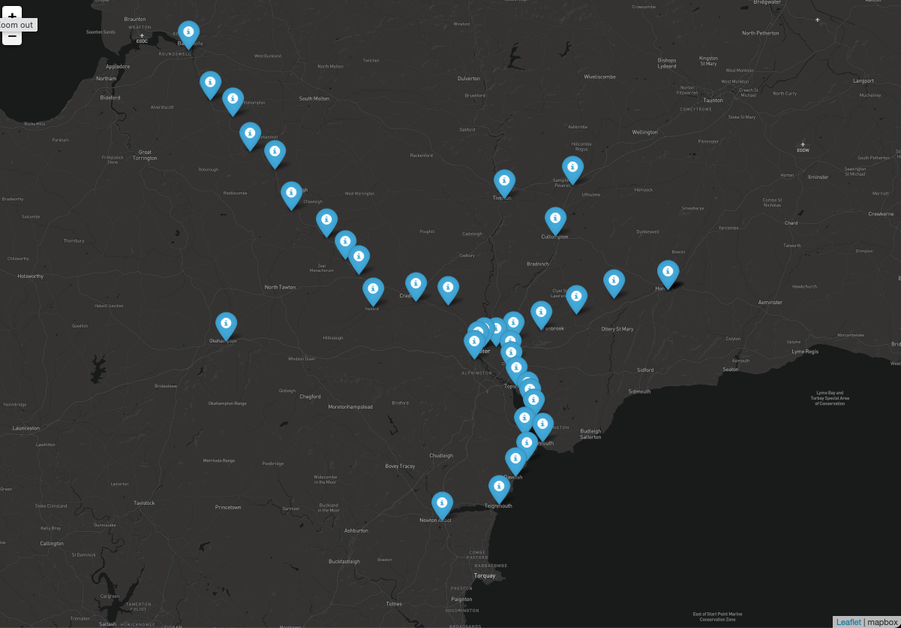
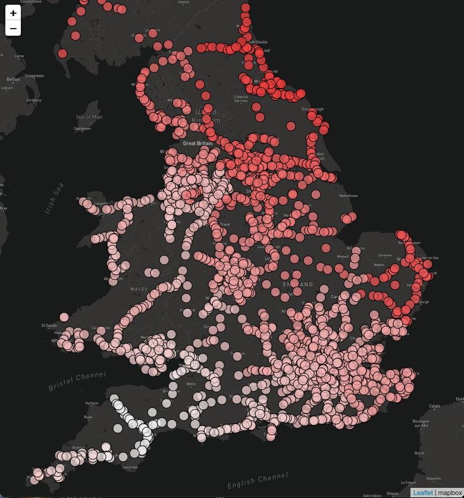

# Cost of train journeys

To install this package, download this repository and run the following from the root directory of the repo:

```bash
# # If you have not previously installed poetry before...
# type the following for osx/linux/bashonwindows:
# curl -sSL https://raw.githubusercontent.com/python-poetry/poetry/master/get-poetry.py | python -
# or type the following if you're on Windows:
# (Invoke-WebRequest -Uri https://raw.githubusercontent.com/python-poetry/poetry/master/get-poetry.py -UseBasicParsing).Content | python -
# See https://python-poetry.org/docs/ for details on installation
poetry install
```

To open a Python session with all the dependencies you can run the following:

```bash
poetry shell
poetry run python
# From the Python shell, load the package to test it's installed:
import railfares.data_parsing as data_parsing
```

You can get the stations reachable with the specified budget from the specified starting station by running the following code:

```import railfares.data_parsing as data_parsing

project_dir = ''

starting_station = 'newcastle'

budget = 10

df = data_parsing.get_isocost_stations(starting_station, budget, project_dir)
```

project_dir``` must contain the path to the data (the data is currently not stored on the repo).

You can also try the interactive flask dashboard by running ```poetry run python dashboard/app.py``` (this will run the dashboard in debug mode) or ```flask run``` from the dashboard folder. As above, you need to set the path to where the data is stored in the ```app.py``` file variable ```project_dir```.

# Useful links

Train stations are referred to using a range of different systems in the data set. Other than the official station name, each station
usually has a common name, a CRS code, an NLC code, and a TIPLOC code. A relatively comprehensive list of these systems is available [here](http://www.railwaycodes.org.uk/crs/crs0.shtm).

Data on the location of train stations with coordinates is available, amongst other sources, as [part of the National  Public Transport Access Nodes (NaPTAN) data set] (https://www.data.gov.uk/dataset/ff93ffc1-6656-47d8-9155-85ea0b8f2251/national-public-transport-access-nodes-naptan).

For developing and debugging, it can be useful to check the fares of specific journeys manually. A great resource to do this is the [BR FARES website](https://www.brfares.com) which gives access to all flows and fares between pairs of stations for all ticket types (select ``Expert Mode'' when querying).

# Tutorial
This is a brief tutorial on how to use this package. The tutorial is also avaiable as a separate script in ```tutorial.py```.

The functions of this package are implemented in ```data_parsing.py```. Any other script is analysing the rail fares data using the basic functions implemented in the package.

NOTE: the mapping functionalities currently use the free-tier services of MapBox to retrieve the map tiles via my account API token. Please create maps in moderation, or replace the token with a different one!

To start with, let's import all the relevant packages we will need in this tutorial:

```bash
import railfares.data_parsing as data_parsing
import pandas as pd
import geopandas as gpd
from folium.plugins import MarkerCluster
from matplotlib.colors import rgb2hex
import folium
```
We then need to set the project directory, which is where the data files are stored:

```bash
project_dir = 'USE_PROJECT_DIRECTORY_PATH'
```

As a first example, we will calculate the list of stations you can reach with a given budget from a starting station.
In the following, we refer to this as an isocost (in analogy with isochrones). Note, however, that this is not strictly speaking going to be an list of stations all reachable with the same budget (as the name isocost would imply), but rather all stations reachable with the given maximum budget.
This means that most stations will actually be reachable with a lower budget.

We start by specifying the name of a starting station, for instance Exeter St Davids:

```bash
starting_station = 'exeter st davids'
```

We then specify the maximum budget we want to use for the calculation:
```bash
budget = 10
```
Again, as noted above, this is a maximum fare, not the exact fare.
Next, we calculate the isocost:
```bash
isocost = data_parsing.get_isocost_stations(starting_station, budget, project_dir)
```

After running this, the ```isocost``` variable contains a Pandas dataframe with all the
stations that can be reached from the starting station with the given budget.
The returned data frame contains the names of all the stations, and the
corresponding fare. It also contains more technical information on the route,
station code names, etc.


You can then create a map of the stations that can be reached. The following
outputs to file an interactive html map:
```bash
#first, set the file path and name (use .html as file extension)
file_path_name = 'USE_PATH_AND_FILE_NAME_TO_OUTPUT'

#then create and output the map
data_parsing.plot_isocost_stations(starting_station, isocost, file_path_name, project_dir)
````

Which should look something  like this:




You can also use the pre-calculated OD matrix to retrieve the cost of reaching
any station from the starting station. NOTE: this section requires to have the OD matrix file

First, read the OD file. This is a large file so will take some time to read
and use a significant amount of memory:
```bash
od_list = pd.read_csv(project_dir + 'od_minimum_cost_matrix.csv', low_memory = False)
```

Next, select the entries corresponding to journeys starting at the starting station
NOTE: the starting station string is converted to upper as in the OD matrix
this is how the station names typically appear. This is for the tutorial purpose
only, as in general it is more accurate to work with CRS or TIPLOC codes which are
unique and do not depend on abbreviation of station names.
```bash
station_od = od_list[od_list['Origin station name'] == starting_station.upper()].copy()
```

This next section of code creates a map to plot the cost of reaching any station
from the starting station defined above.

In order to create a map with a good colour scheme, we set a maximum price
of 300 GBP; however, in practice this is usually not exceeded for journeys considered
here, but might need to be changed if considering a different type of journeys.

```bash
max_price = 300
step = 10
bins = list(range(0, max_price + step, step))
n_bins = max_price / step


labels = []
colour_step = 240/n_bins

r = 240
g = 240
b= 240

for i in range(0, int(n_bins), 1):
    
    labels.append(rgb2hex([r/255, (g)/255, (b)/255]))
    g = g - colour_step
    b = b - colour_step
    
station_od['marker_colour'] = pd.cut(station_od['fare'], bins = bins,
                                    labels =labels)

station_od['Destination station name'] = station_od['Destination station name'].str.rstrip()
station_od['popupText'] = ['Starting station: ' + starting_station + ',<br> Destination station: ' + row['Destination station name'].lower() + ',<br> Fare: £' + str(row['fare']).ljust(4,'0') for idx, row in station_od.iterrows()]

naptan_gdf = data_parsing.get_naptan_data(project_dir)
naptan_gdf = naptan_gdf.to_crs(epsg = 4326)

station_gdf = data_parsing.get_station_location(project_dir, tiploc = True)
station_gdf = station_gdf.to_crs(epsg = 4326)

stations = gpd.GeoDataFrame(naptan_gdf.merge(station_gdf, left_on = 'TIPLOC', right_on = 'tiploc_code', how = 'left').drop(columns = ['geometry_y', 'Easting', 'Northing'], axis = 1).rename(columns = {'geometry_x': 'geometry'}))

station_od_gdf = stations.merge(station_od, left_on = 'CRS Code', right_on = 'destination_crs')

od_list_min = station_od_gdf.loc[station_od_gdf.groupby(['Destination station name'])['fare'].idxmin()]

cost_map = folium.Map(location = [station_gdf.dissolve().centroid[0].coords[0][1],station_gdf.dissolve().centroid[0].coords[0][0]], 
                      tiles = "https://api.mapbox.com/styles/v1/mapbox/dark-v10/tiles/{z}/{x}/{y}?access_token=pk.eyJ1IjoiZmVkZWJvdHRhIiwiYSI6ImNsNnZzZmx1bDA0aXozYnA5NHNxc2oxYm4ifQ.NH-kHQqlCLP3OVnx5ygJlQ",
                      attr='mapbox', zoom_start = 7)
# svg_style = '<style>svg {background-color: white;}</style>'

# colormap.get_root().header.add_child(folium.Element(svg_style))
# cost_map.add_child(colormap)

marker_cluster = MarkerCluster(name = "Train stations").add_to(cost_map)

od_list_min = od_list_min.to_crs(epsg = 4326)

for idx, row in od_list_min.iterrows():
    
    
    folium.CircleMarker([row["geometry"].y, row['geometry'].x],
                  icon=folium.Icon(color = '#000000', icon_color=row['marker_colour']),
                  fill = True, fill_color = row['marker_colour'], color = '#000000', fill_opacity = 0.75, radius = 8, weight = 1,
                  popup = row['popupText']).add_to(cost_map)

#use this variable to specify the path and file name(with .html extension) where the map should be saved
file_path_name = ''
cost_map.save(file_path_name)

```

The resulting map should look something like this:



where darker shades of red correspond to a higher fare.

